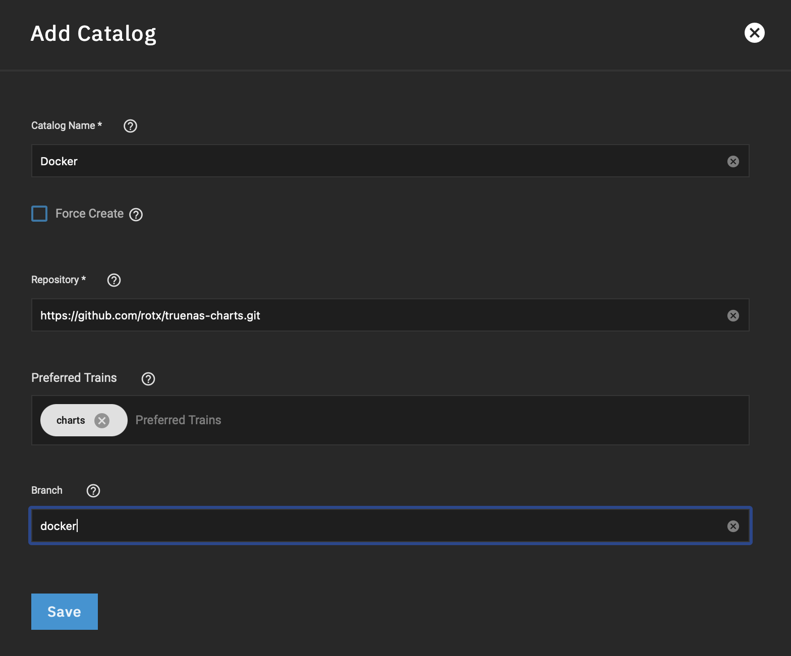
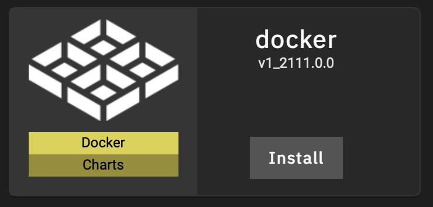

# Extended Chart for Launching Docker Containers

This repository is a fork of https://github.com/truenas/charts. It contains an extended (“expert”) version of “iX-chart” that is used when using the “Launch Docker Image” in the TrueNAS SCALE GUI.

This chart provides the following additional functionality:

* The Kubernetes [workload type](https://kubernetes.io/docs/concepts/workloads/) can be changed from *Deployment* to *CronJob*.
* The Kubernetes [service](https://kubernetes.io/docs/concepts/services-networking/service/) can be changed from *NodePort* to *ClusterIP*, *LoadBalancer*, or *ExternalName*, and “Node Ports” are optional, and *externalTrafficPolicy* can be specified.
* The “Restart Policy” and several network options have been exposed.

## Installation

To use this catalog, go to “Apps”, “Manage Catalogs” in the TrueNAS SCALE GUI and click “Add Catalog”.

Assign a name (e.g., `Docker`), and use `https://github.com/rotx/truenas-charts.git` as the catalog repository URL with branch `docker`. The preferred train should be the default (`charts`).

## Launching Docker Images

To use the new chart and launch a docker image, go to “Available Applications” and click on “Install” for “docker”. The GUI will present options that are similar to the built-in “Launch Docker Image”, with the additional enhancements listed above.

